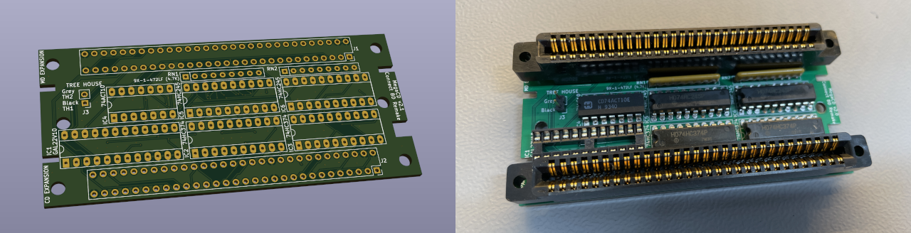
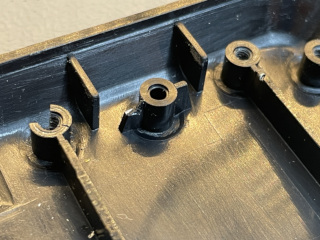

# MegaCD-Connect-BD-Remake
This is the Schematics, PCB and Logic for the Mega-CD Connect BD Targeting the 315-5477 (MCE V1) MegaCD.

It is to replace the 837-8327-01 IC BD MEGA-CD CONNECT BD with a failed ASIC to the older Logic version of the board that has the Peel IC.

The board is not a clone, rather a remake as i do not have access to an original logic board version to do an exact replica of traces.



* The Gerbers have been created using the recommendations from JLCPCB.

* This board uses a GAL22V10 to achieve the same logic functions as the Peel IC. Jed file is provided.
  Use a MiniPro to write the Jed file to the GAL Chip.

Notes:- 

 * I have used an ATF22V10B-15PC as a replacement for the GAL22V10. The ATF Works, but i also see this is obsolete. There is ATF22V10C range of chips, but stock seems to be low on these.

 * TESTED V2.0 and this worked, but now made V2.2 and is UNTESTED
   
 * Finally got some GAL20v8 Chips, and they do not work. Think this is a timing issue. So please use the GAL22v10's instead, unless someone wants to take a stab at getting the GAL20v8's to work. (Looks at Steve)


Version 2.2 Changes:-

* Moved traces around the middle screw holes, just incase screw heads sub against the silkscreen removing it and causing a short against the 5v rail.

* Moved the IC1 Silk name slightly up.

Version 2.1 Changes:-

* Moved /TRDIR from PIN 23 to PIN 15, This should make it compatible with the GAL20V8

* Added GAL20V8 Logic, but does not work.

* Updated Labels for Tree House Connection, TH1 and TH2

### Compiling The Logic
---

The software i used to make the Jed file was GALasm. It can be downloaded from here https://github.com/daveho/GALasm

Only source files is provide, so you will need to compile GALasm first. I used MacOS to do this, Linux should work and maybe Windows ???

Once GALasm is compiled, use the following command to compile the Logic into a Jed file from within the GAL22V10 folder.

```
galasm ./GAL22V10.pld
```

### Fitting the Board
---

**1. Post**

---

There is a slight modification required to make the PCB fit in the original housing.


<br>This Post would need a little snip to allow the GAL chip pins to sit correctly in the housing.

**2. Tree House J3**

---

If you use a Pin Header, you will need to bend it slighly inwards otherwise it will not fit inside the MegaCD.


### BOM

---

| Reference | Value               | Quantity | DigiKey            |
|-----------|---------------------|----------|--------------------|
| C1 - C6   | 100nf               | 6        | CL31B104KBCNNNC    |
| IC1       | GAL22V10B           | 1        |                    |
| IC2, IC3  | 74HC374             | 2        | 296-1592-5-ND      |
| IC4       | 74ACT10             | 1        | CD74ACT10E-ND      |
| IC5, IC6  | 74HC245             | 2        | 296-1584-5-ND      |
| RN1, RN2  | 9X-1-472LF (4.7K)   | 2        | 4609X-101-472LF-ND |
| J1, J2    | CONN EDGE DF 60POS  | 2        | A112392-ND         |
| J3        | 2 Pin Header 2.54mm | 1        | 609-4434-ND        |

[**Interactive BOM**][IBOM]

## Thanks

With thanks to @fabiodl for decoding the logic of the Peel IC

* https://github.com/fabiodl/peelDecoder

#### Other Resources

* https://circuit-board.de/forum/index.php/Thread/25582-SEGA-MEGA-CD-1-Reparatur-PEEL-18CV8-PLD-auslesen/

* https://www.eevblog.com/forum/projects/help-with-reverse-engineering-unexpected-behavior-of-peel18cv8-223204/


### !!!!! WARNING !!!!!

Use at your own risk. I accept no responsibility.

[IBOM]: http://htmlpreview.github.io/?https://raw.githubusercontent.com/chris-jh/MegaCD-Connect-BD-Remake/main/bom/ibom.html
